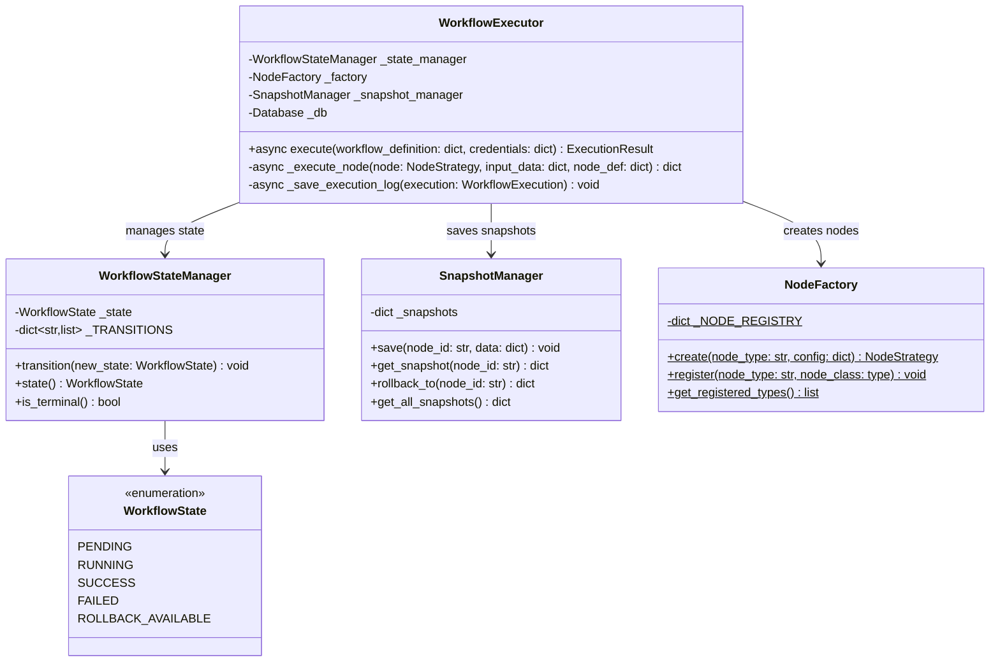
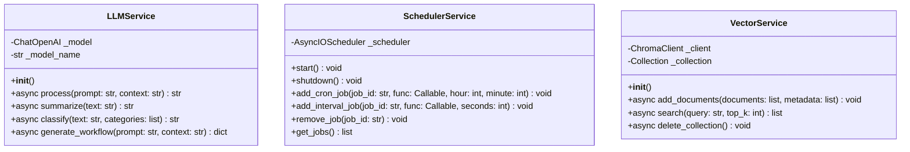
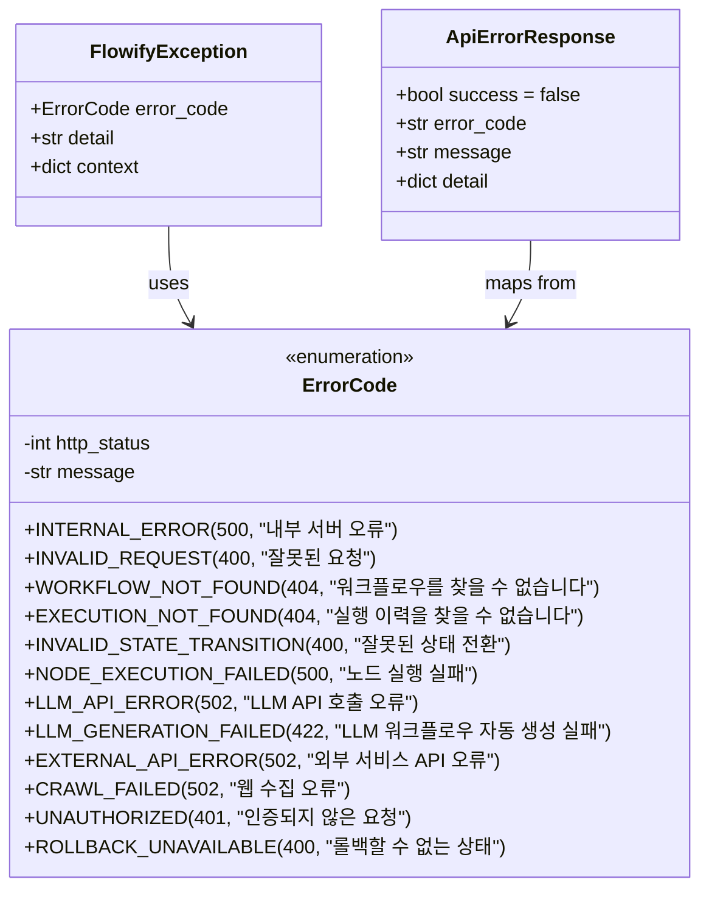
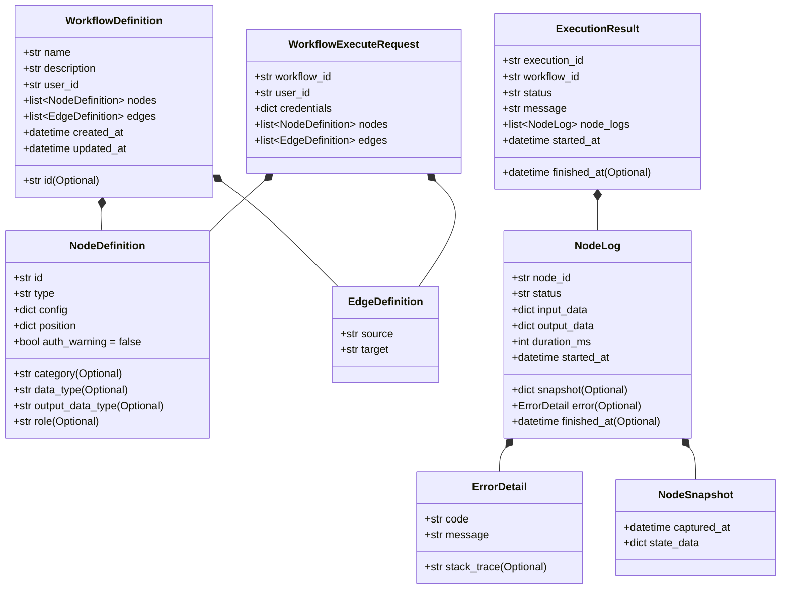

# 2. FastAPI 클래스 다이어그램 (Class Diagram)

> Spring Boot `4_class_diagram.md` 대응 문서
> FastAPI 서버 내부의 핵심 클래스와 관계를 서브시스템별로 정의합니다.

---

## PK-F01: 워크플로우 실행 엔진 (Core Engine)

워크플로우의 실행을 조율하는 핵심 엔진 계층입니다. Strategy, Factory, State 패턴이 조합됩니다.



### 패턴 설명

- **State Pattern (`WorkflowStateManager`)**: 워크플로우 실행의 라이프사이클을 관리합니다. 유효한 상태 전환만 허용하며, 잘못된 전환 시 `InvalidStateTransition` 예외를 발생시킵니다.
- **Factory Pattern (`NodeFactory`)**: 노드 타입 문자열로부터 적절한 `NodeStrategy` 인스턴스를 생성합니다. `@classmethod`로 구현되어 별도 인스턴스 없이 사용 가능합니다.
- **Memento Pattern (`SnapshotManager`)**: 각 노드 실행 전 데이터 스냅샷을 저장하여, 실패 시 이전 상태로 복원할 수 있습니다.

---

## PK-F02: 노드 전략 (Node Strategy)

개별 노드의 실행 로직을 캡슐화하는 계층입니다. Strategy 패턴으로 확장에 개방적입니다.
기능 요구사항에서 정의된 **6가지 내부 노드 타입**(LOOP, CONDITION_BRANCH, AI, DATA_FILTER, AI_FILTER, PASSTHROUGH)을 모두 지원합니다.

```mermaid
classDiagram
    class NodeStrategy {
        <<abstract>>
        #config: dict
        +__init__(config: dict)
        +execute(input_data: dict) dict*
        +validate() bool*
    }

    class InputNodeStrategy {
        -config: dict
        -GoogleDriveService _google_drive
        -GmailService _gmail
        -GoogleSheetsService _sheets
        -GoogleCalendarService _calendar
        -WebCrawlerService _web_crawler
        +execute(input_data: dict) dict
        +validate() bool
        -_fetch_from_google_drive(token: str, config: dict) dict
        -_fetch_from_gmail(token: str, config: dict) dict
        -_fetch_from_google_sheets(token: str, config: dict) dict
        -_fetch_from_google_calendar(token: str, config: dict) dict
        -_fetch_from_web_crawl(config: dict) dict
        -_resolve_source(config: dict) str
    }

    class LLMNodeStrategy {
        -config: dict
        -LLMService _llm_service
        +execute(input_data: dict) dict
        +validate() bool
        -_resolve_action(config: dict) str
        -_build_input_text(input_data: dict, config: dict) str
    }

    class IfElseNodeStrategy {
        -config: dict
        +execute(input_data: dict) dict
        +validate() bool
        -_evaluate_condition(field: str, operator: str, value: any, data: dict) bool
        -_resolve_branch(result: bool, input_data: dict) dict
        -_build_multi_branch(conditions: list, input_data: dict) dict
    }

    class LoopNodeStrategy {
        -config: dict
        -int MAX_ITERATIONS$ = 1000
        -int DEFAULT_TIMEOUT_SECONDS$ = 300
        -NodeFactory _factory
        +execute(input_data: dict) dict
        +validate() bool
        -_iterate_items(items: list, inner_nodes: list, input_data: dict) list
        -_check_timeout(start_time: float) void
        -_check_early_stop(item_result: dict) bool
    }

    class DataFilterNodeStrategy {
        -config: dict
        +execute(input_data: dict) dict
        +validate() bool
        -_apply_filter(items: list, conditions: list) list
        -_remove_duplicates(items: list, unique_field: str) list
        -_evaluate_condition(item: dict, condition: dict) bool
    }

    class AIFilterNodeStrategy {
        -config: dict
        -LLMService _llm_service
        +execute(input_data: dict) dict
        +validate() bool
        -_filter_with_ai(items: list, criteria: str) list
        -_build_filter_prompt(item: dict, criteria: str) str
    }

    class PassthroughNodeStrategy {
        -config: dict
        +execute(input_data: dict) dict
        +validate() bool
    }

    class OutputNodeStrategy {
        -config: dict
        -SlackService _slack
        -NotionService _notion
        -GmailService _gmail
        -GoogleDriveService _google_drive
        -GoogleSheetsService _sheets
        -GoogleCalendarService _calendar
        +execute(input_data: dict) dict
        +validate() bool
        -_send_to_slack(token: str, config: dict, data: dict) dict
        -_send_to_notion(token: str, config: dict, data: dict) dict
        -_send_to_gmail(token: str, config: dict, data: dict) dict
        -_save_to_google_drive(token: str, config: dict, data: dict) dict
        -_write_to_google_sheets(token: str, config: dict, data: dict) dict
        -_create_calendar_event(token: str, config: dict, data: dict) dict
        -_resolve_target(config: dict) str
    }

    NodeStrategy <|-- InputNodeStrategy
    NodeStrategy <|-- LLMNodeStrategy
    NodeStrategy <|-- IfElseNodeStrategy
    NodeStrategy <|-- LoopNodeStrategy
    NodeStrategy <|-- DataFilterNodeStrategy
    NodeStrategy <|-- AIFilterNodeStrategy
    NodeStrategy <|-- PassthroughNodeStrategy
    NodeStrategy <|-- OutputNodeStrategy
```



### 노드 타입 등록 테이블

| 등록 키 | 클래스 | 내부 노드 타입 | 설명 | 파일 위치 |
|---------|--------|-------------|------|-----------|
| `input` | `InputNodeStrategy` | - | 외부 서비스에서 데이터 수집 | `app/core/nodes/input_node.py` |
| `llm` | `LLMNodeStrategy` | AI | LLM 기반 AI 처리 | `app/core/nodes/llm_node.py` |
| `if_else` | `IfElseNodeStrategy` | CONDITION_BRANCH | 조건 분기 | `app/core/nodes/logic_node.py` |
| `loop` | `LoopNodeStrategy` | LOOP | 반복 처리 | `app/core/nodes/logic_node.py` |
| `data_filter` | `DataFilterNodeStrategy` | DATA_FILTER | 필드/조건 기반 데이터 필터링 | `app/core/nodes/filter_node.py` |
| `ai_filter` | `AIFilterNodeStrategy` | AI_FILTER | AI 판단 기반 필터링 | `app/core/nodes/filter_node.py` |
| `passthrough` | `PassthroughNodeStrategy` | PASSTHROUGH | 변환 없이 그대로 전달 | `app/core/nodes/passthrough_node.py` |
| `output` | `OutputNodeStrategy` | - | 외부 서비스로 결과 전송 | `app/core/nodes/output_node.py` |

### 사용자 선택 → 내부 노드 타입 → Strategy 매핑

> `mapping_rules.json`의 선택지에 따라 시스템이 내부적으로 노드 타입을 결정합니다 (SFR-04).

| 사용자 선택 | 내부 노드 타입 | NodeFactory 키 | Strategy 클래스 | 관련 UC |
|-----------|-------------|---------------|---------------|---------|
| "한 파일씩" / "하나씩" | LOOP | `loop` | LoopNodeStrategy | UC-P03 |
| "파일 종류별로" / "발신자별로" | CONDITION_BRANCH | `if_else` | IfElseNodeStrategy | UC-P04, P05 |
| "필요한 항목만 선택" / "특정 조건" | DATA_FILTER | `data_filter` | DataFilterNodeStrategy | UC-P02 |
| "조건에 맞는 것만 (AI 판단)" | AI_FILTER | `ai_filter` | AIFilterNodeStrategy | UC-P02 |
| "그대로 전달" | PASSTHROUGH | `passthrough` | PassthroughNodeStrategy | - |
| "내용 요약" / "번역" 등 가공 | AI | `llm` | LLMNodeStrategy | UC-P06 |

---

## PK-F03: 서비스 레이어 (Service Layer)

비즈니스 로직과 외부 의존성을 캡슐화하는 서비스 계층입니다.



---

## PK-F04: 외부 연동 서비스 (Integration Layer)

Spring Boot로부터 전달받은 복호화된 OAuth 토큰을 사용하여 외부 서비스 API를 호출합니다.
SFR-03(서비스 연동 노드)의 UC-S01~S05를 지원하기 위해 **7개 통합 서비스**를 제공합니다.

```mermaid
classDiagram
    class GoogleDriveService {
        +async list_files(token: str, folder_id: str) list
        +async download_file(token: str, file_id: str) dict
        +async upload_file(token: str, name: str, content: bytes, folder_id: str) dict
        +async watch_changes(token: str, folder_id: str) dict
    }

    class GmailService {
        +async list_messages(token: str, query: str, max_results: int) list
        +async get_message(token: str, message_id: str) dict
        +async send_message(token: str, to: str, subject: str, body: str) dict
        +async watch_inbox(token: str) dict
    }

    class GoogleSheetsService {
        +async read_range(token: str, spreadsheet_id: str, range: str) list
        +async write_range(token: str, spreadsheet_id: str, range: str, values: list) dict
        +async append_rows(token: str, spreadsheet_id: str, range: str, values: list) dict
        +async list_sheets(token: str, spreadsheet_id: str) list
    }

    class GoogleCalendarService {
        +async list_events(token: str, calendar_id: str, time_min: str, time_max: str) list
        +async create_event(token: str, calendar_id: str, event: dict) dict
        +async list_calendars(token: str) list
    }

    class SlackService {
        +async send_message(token: str, channel: str, text: str) dict
        +async list_channels(token: str) list
    }

    class NotionService {
        +async create_page(token: str, parent_id: str, title: str, content: str) dict
        +async update_page(token: str, page_id: str, content: str) dict
        +async get_page(token: str, page_id: str) dict
    }

    class WebCrawlerService {
        +async crawl(url: str, selectors: dict) dict
        +async crawl_multiple(urls: list, selectors: dict) list
        -_parse_html(html: str, selectors: dict) dict
    }

    class RestAPIService {
        +async call(url: str, method: str, headers: dict, params: dict, body: dict, timeout: int) dict
    }
```



### 서비스별 의존성

| 서비스 | 외부 라이브러리 | 인증 방식 | 관련 UC |
|--------|---------------|-----------|---------|
| GoogleDriveService | `google-api-python-client`, `httpx` | OAuth 2.0 Bearer Token | UC-S02 |
| GmailService | `google-api-python-client`, `httpx` | OAuth 2.0 Bearer Token | UC-S01 |
| GoogleSheetsService | `google-api-python-client`, `httpx` | OAuth 2.0 Bearer Token | UC-S03 |
| GoogleCalendarService | `google-api-python-client`, `httpx` | OAuth 2.0 Bearer Token | UC-S05 |
| SlackService | `httpx` | Bot Token (xoxb-) | UC-S01 |
| NotionService | `httpx` | Integration Token | UC-S02 |
| WebCrawlerService | `httpx`, `beautifulsoup4` | 없음 (공개 페이지) | UC-S04 |
| RestAPIService | `httpx` | 호출 시 전달 | - |

---

## PK-F05: API 레이어 (API Layer)

Spring Boot로부터 내부 API 요청을 수신하고 응답하는 계층입니다.

```mermaid
classDiagram
    class InternalAuthMiddleware {
        -str _internal_token
        +__init__(app: ASGIApp, internal_token: str)
        +async __call__(scope, receive, send) void
    }

    class WorkflowRouter {
        +POST /workflows/{id}/execute
    }

    class ExecutionRouter {
        +GET /executions/{id}/status
        +GET /executions/{id}/logs
        +POST /executions/{id}/rollback
    }

    class LLMRouter {
        +POST /llm/process
        +POST /llm/generate-workflow
    }

    class TriggerRouter {
        +POST /triggers
        +DELETE /triggers/{id}
        +GET /triggers
    }

    class HealthRouter {
        +GET /health
    }

    class Dependencies {
        +get_db() Database
        +get_user_id(request: Request) str
    }

    InternalAuthMiddleware ..> WorkflowRouter : protects
    InternalAuthMiddleware ..> ExecutionRouter : protects
    InternalAuthMiddleware ..> LLMRouter : protects
    InternalAuthMiddleware ..> TriggerRouter : protects
    Dependencies ..> WorkflowRouter : injects
    Dependencies ..> ExecutionRouter : injects
```

### 라우터 접두사 구조

```
/api/v1
├── /health                          → HealthRouter
├── /workflows/{id}/execute          → WorkflowRouter
├── /executions/{id}/status          → ExecutionRouter
├── /executions/{id}/logs            → ExecutionRouter
├── /executions/{id}/rollback        → ExecutionRouter
├── /llm/process                     → LLMRouter
├── /llm/generate-workflow           → LLMRouter
└── /triggers                        → TriggerRouter
```

---

## PK-F06: 공통 모듈 (Common)

에러 핸들링, 데이터 모델, 유틸리티를 포함하는 공통 계층입니다.



### Pydantic 모델 계층


