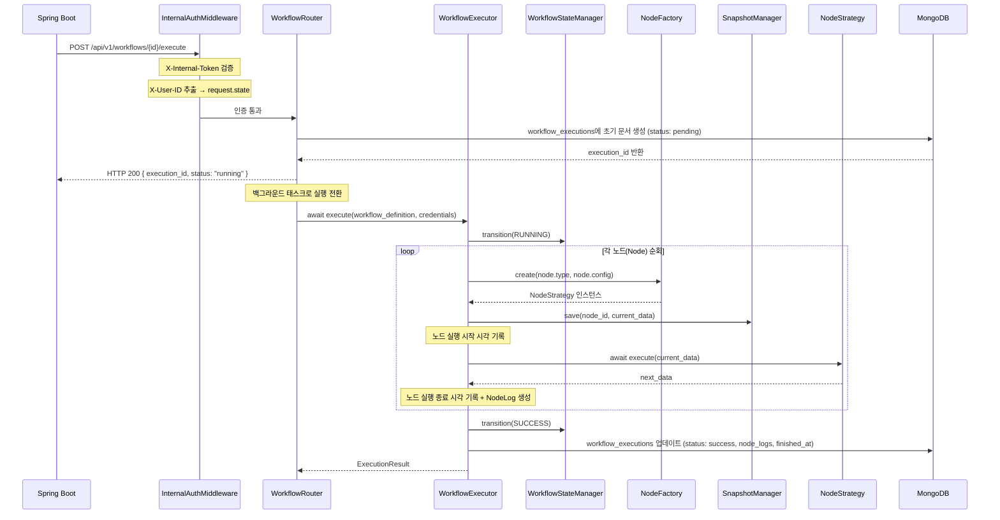
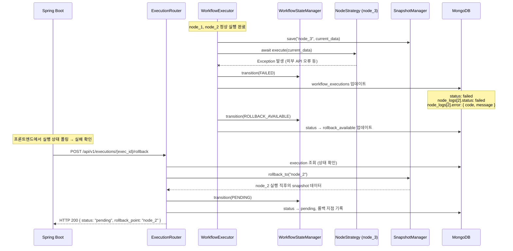
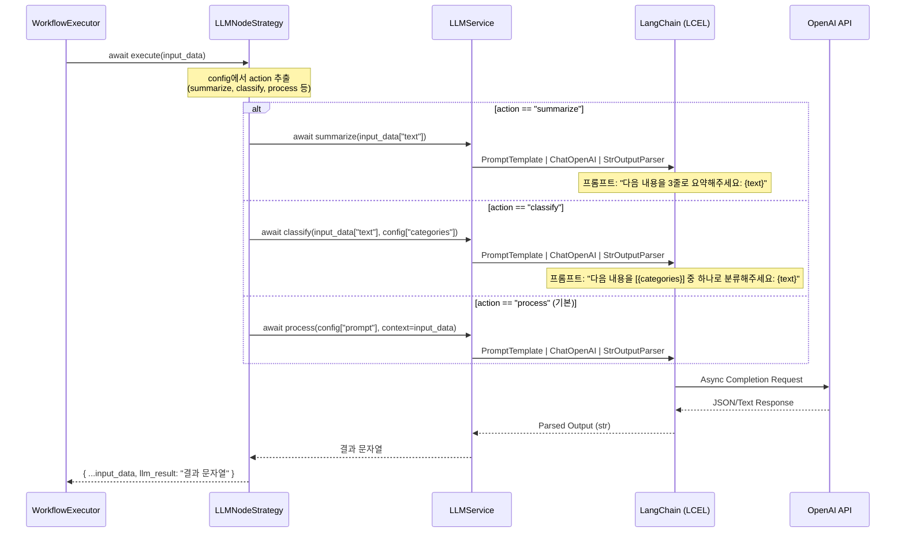
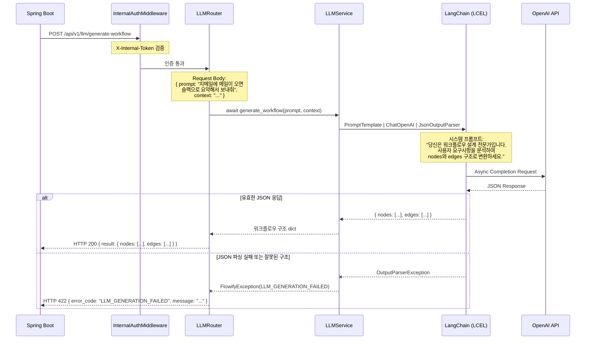
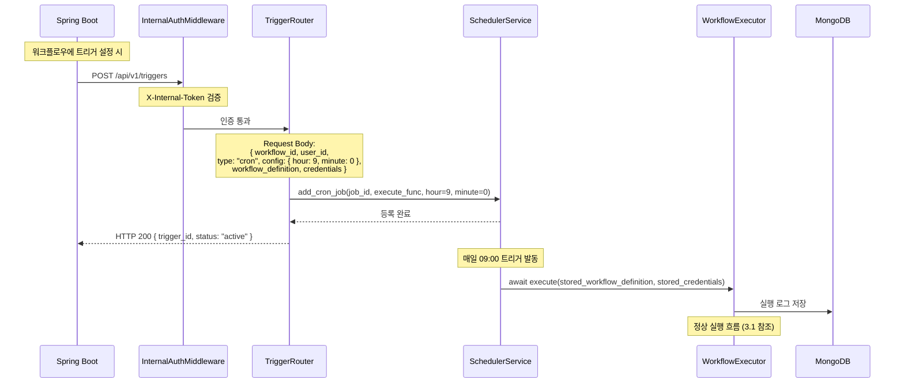
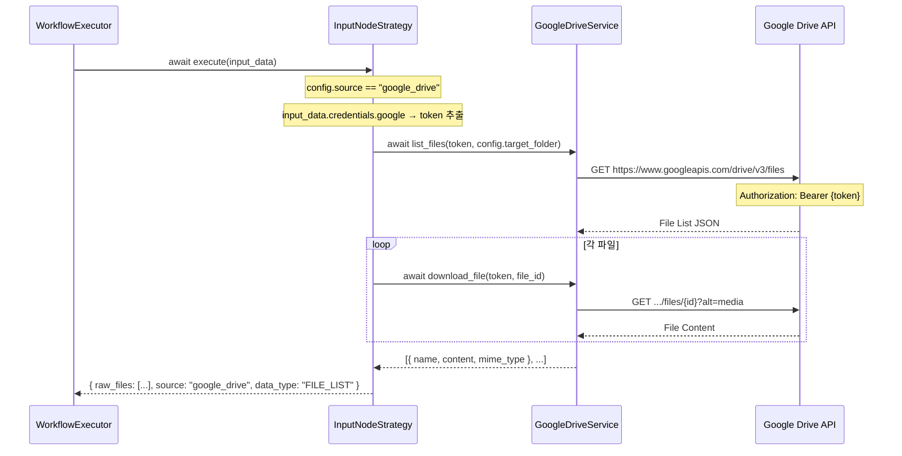
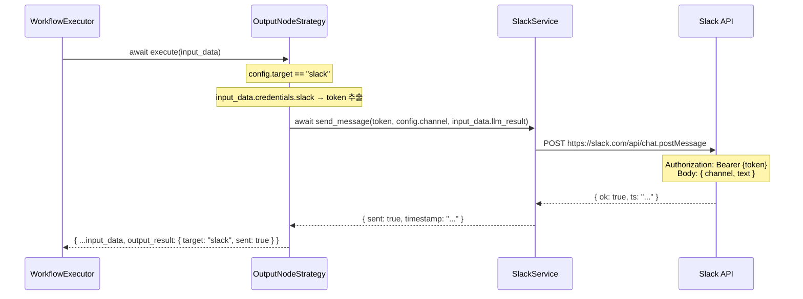
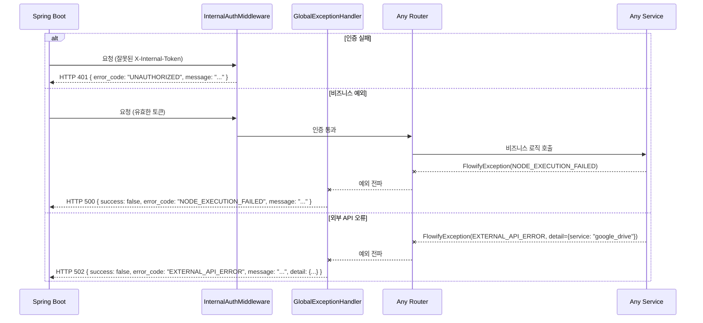

# 3. FastAPI 시퀀스 다이어그램 (Sequence Diagram)

> Spring Boot `5_sequence_diagram.md` 대응 문서
> FastAPI 서버 내부의 주요 실행 흐름을 시퀀스 다이어그램으로 정의합니다.

---

## 3.1 UC-E01: 워크플로우 전체 실행 (정상 흐름)

Spring Boot로부터 워크플로우 실행 요청을 받아 성공적으로 처리하는 정상 흐름입니다.

---

## 3.2 UC-E01-ERR: 워크플로우 실행 실패 및 롤백

노드 실행 중 오류 발생 시 FAILED 상태로 전환하고, 롤백 가능 상태로 전환하는 흐름입니다.

---

## 3.3 UC-A01: LLM 노드 실행 상세 흐름

워크플로우 내에서 `LLMNodeStrategy`가 호출되어 LangChain 및 OpenAI를 거쳐 결과를 반환하는 상세 흐름입니다.

---

## 3.4 UC-W02: LLM 기반 워크플로우 자동 생성

Spring Boot가 사용자의 자연어 프롬프트를 FastAPI에 전달하여, LLM이 워크플로우 구조(노드/엣지)를 자동 생성하는 흐름입니다.

---

## 3.5 UC-P01: 트리거 기반 자동 실행

APScheduler를 통해 등록된 스케줄 트리거가 워크플로우를 자동 실행하는 흐름입니다.

---

## 3.6 외부 서비스 연동 흐름 (Input/Output 노드)

### 3.6.1 InputNodeStrategy - Google Drive 파일 수집

### 3.6.2 OutputNodeStrategy - Slack 메시지 전송

---

## 3.7 에러 전파 흐름 (Exception Propagation)

